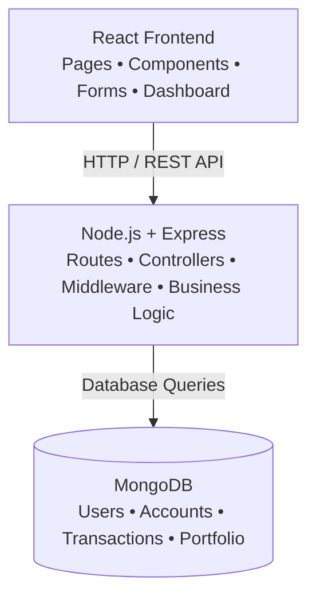

# 🏦 ApexBank - Full-Stack Banking Management System

A full-stack banking web application built with React, Node.js, Express.js, and MongoDB.

The project simulates a digital banking system where users can create an account, log in, check their balance, transfer money, and view their transaction history.

> This project is built for learning and demonstration purposes. It does not handle real money.

## 📖 Overview

ApexBank is a banking management system developed as a full-stack web application.

The frontend is built with React and communicates with a Node.js/Express backend through REST APIs. The backend handles authentication, account operations, money transfers, and transaction records, while MongoDB is used to store the application data.

The main goal of the project was to understand how a real-world banking-style application can be structured using the MERN stack.

---

## ⚡ Features

### 🔐 Authentication

- User registration and login
- JWT-based authentication
- Password hashing using bcrypt
- Protected routes
- Transaction PIN protection

### 💳 Account Management

- Create and manage user accounts
- View account balance
- View account information
- Check transaction history

### 💸 Money Transfers

- Transfer money between users
- Validate sender balance
- Validate receiver account
- Validate transaction PIN
- Prevent invalid or negative transfer amounts
- Store every transaction

### 📜 Transaction History

- View previous transactions
- Track sender and receiver
- Transaction amount
- Transaction type
- Transaction status
- Transaction timestamp

### 📱 Frontend

- Responsive React interface
- Banking dashboard
- Transaction pages
- Account management pages
- Investment/portfolio interface

## 🏗️ System Architecture

The application follows a simple client-server architecture.

